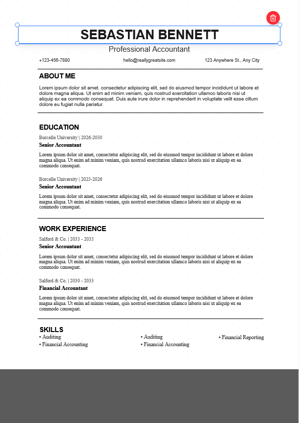

# DocDesign

<p align="center">
  Convert static document images into editable documents.
</p>

## Overview

DocDesign is a web application that allows users to transform static document images into editable documents without recreating them from scratch.

Whether it's a resume template, project cover page, report, or document layout, DocDesign provides an interactive editing environment where users can modify content, customize styling, and export the final document in multiple formats.

---

## Problem

Many document templates available online are shared as images or PDFs.

This creates several challenges:

- Content cannot be edited easily
- Users must recreate layouts manually
- Formatting takes significant time
- Small modifications require rebuilding the entire document

DocDesign solves this by providing a visual editor that enables direct editing of document content.

---

## Features

### Editable Document Canvas
- Edit document content directly
- Select and modify text elements
- Real-time document customization

### Typography Controls
- Font size adjustments
- Font family selection
- Text alignment controls
- Text styling options

### Design Customization
- Text color controls
- Border adjustments
- Corner radius customization
- Layout positioning tools

### Export Support
Export your edited document as:
- Image
- PDF
- Word Document

### Local Storage
- Save designs locally
- Continue editing later
- No mandatory server storage

### User Friendly Interface
- Clean editing workspace
- Simple drag-and-edit workflow
- Beginner friendly experience

---

## Screenshots




---

## Tech Stack

### Frontend
- React.js
- Tailwind CSS

### Backend
- Node.js
- Express.js

### Database
- MongoDB

### Design
- Figma

---

## Use Cases

### Resume Editing
Modify resume templates without recreating them.

### Project Front Pages
Quickly update project covers and report pages.

### Document Templates
Customize document layouts with minimal effort.

### Last-Minute Changes
Make edits directly instead of redesigning entire documents.

---

## Installation

### Clone Repository

```bash
git clone https://github.com/Bored008/DocDesign.git
```

### Navigate to Project

```bash
cd DocDesign
```

### Install Dependencies

Frontend

```bash
npm install
```

Backend

```bash
npm install
```

### Run Development Server

Frontend

```bash
npm run dev
```

Backend

```bash
npm start
```

---

## Project Workflow

1. Upload a document image
2. Convert image into editable layout
3. Modify content and styling
4. Preview changes
5. Export final document

---

## Future Improvements

- OCR-powered text detection
- Drag-and-drop components
- Template marketplace
- Real-time collaboration
- Cloud storage integration
- AI-assisted document editing
- Version history support

---

## Learning Outcomes

Through this project, I explored:

- Interactive document editing systems
- UI/UX design workflows
- Canvas-based editing interfaces
- React component architecture
- Local storage management
- Export generation workflows

---

## Contributing

Contributions, issues, and feature requests are welcome.

Feel free to fork the repository and submit a pull request.

---

## Author

**Himanshu**

- GitHub: https://github.com/Bored008

---

⭐ If you found this project useful, consider starring the repository.